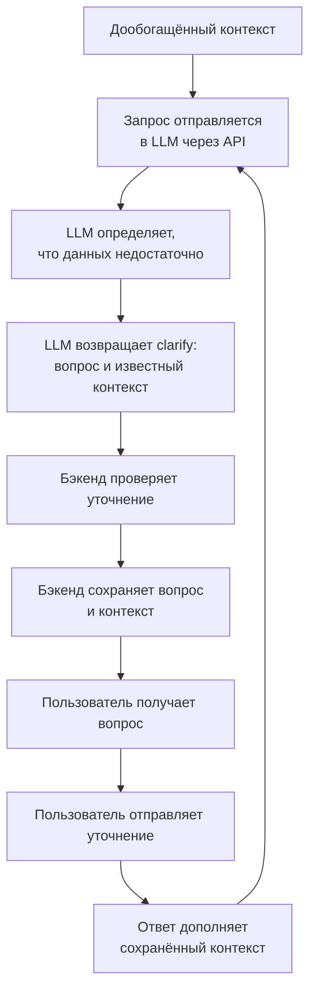

# Сценарий `clarify`

[← Все сценарии](README.md)

Модель задаёт уточняющий вопрос и сохраняет известные параметры, чтобы продолжить после ответа пользователя.

```mermaid
flowchart TD
    C["Дообогащённый контекст"]
    API["Запрос отправляется<br/>в LLM через API"]
    L["LLM определяет,<br/>что данных недостаточно"]
    CL["LLM возвращает clarify:<br/>вопрос и известный контекст"]
    CHECK["Бэкенд проверяет уточнение"]
    SAVE["Бэкенд сохраняет вопрос<br/>и контекст"]
    USER["Пользователь получает вопрос"]
    REPLY["Пользователь отправляет уточнение"]
    MERGE["Ответ дополняет<br/>сохранённый контекст"]

    C --> API
    API --> L
    L --> CL
    CL --> CHECK
    CHECK --> SAVE
    SAVE --> USER
    USER --> REPLY
    REPLY --> MERGE
    MERGE --> API
```
