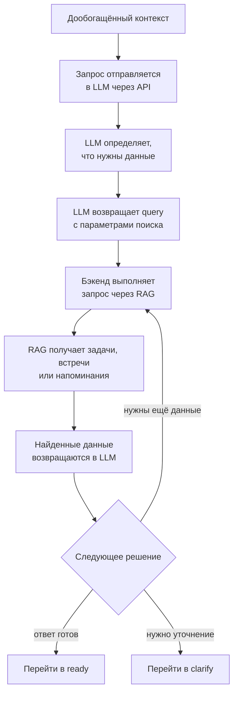

# Сценарий `query`

[← Все сценарии](README.md)

Модель запрашивает сохранённые данные через RAG. Результат возвращается в LLM для следующего решения.

```mermaid
flowchart TD
    C["Дообогащённый контекст"]
    API["Запрос отправляется<br/>в LLM через API"]
    L["LLM определяет,<br/>что нужны данные"]
    Q["LLM возвращает query<br/>с параметрами поиска"]
    RAG["Бэкенд выполняет<br/>запрос через RAG"]
    DB["RAG получает задачи, встречи<br/>или напоминания"]
    RESULT["Найденные данные<br/>возвращаются в LLM"]
    NEXT{"Следующее решение"}
    READY["Перейти в ready"]
    CLARIFY["Перейти в clarify"]

    C --> API
    API --> L
    L --> Q
    Q --> RAG
    RAG --> DB
    DB --> RESULT
    RESULT --> NEXT
    NEXT -->|ответ готов| READY
    NEXT -->|нужно уточнение| CLARIFY
    NEXT -->|нужны ещё данные| RAG
```
