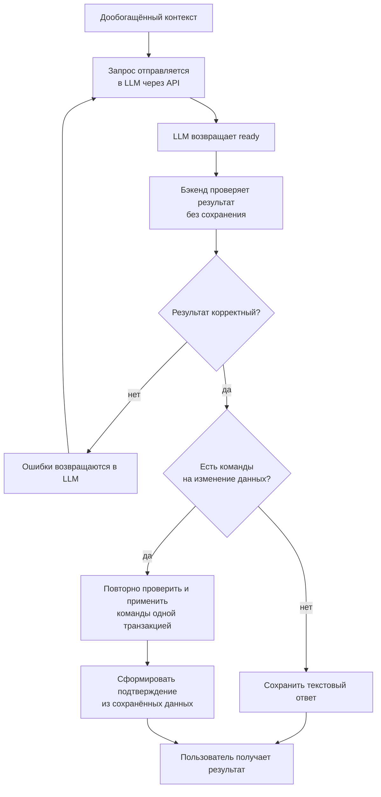

# Сценарий `ready`

[← Все сценарии](README.md)

Модель возвращает готовый ответ и/или команды на создание, изменение или удаление данных.

```mermaid
flowchart TD
    C["Дообогащённый контекст"]
    API["Запрос отправляется<br/>в LLM через API"]
    L["LLM возвращает ready"]
    CHECK["Бэкенд проверяет результат<br/>без сохранения"]
    VALID{"Результат корректный?"}
    ERROR["Ошибки возвращаются в LLM"]
    COMMANDS{"Есть команды<br/>на изменение данных?"}
    ANSWER["Сохранить текстовый ответ"]
    APPLY["Повторно проверить и применить<br/>команды одной транзакцией"]
    CONFIRM["Сформировать подтверждение<br/>из сохранённых данных"]
    USER["Пользователь получает результат"]

    C --> API
    API --> L
    L --> CHECK
    CHECK --> VALID
    VALID -->|нет| ERROR
    ERROR --> API
    VALID -->|да| COMMANDS
    COMMANDS -->|нет| ANSWER
    COMMANDS -->|да| APPLY
    APPLY --> CONFIRM
    ANSWER --> USER
    CONFIRM --> USER
```
